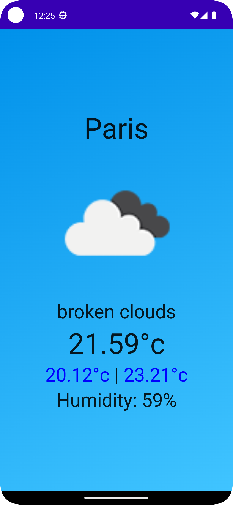

# Android application My weather App 

#This application that displays the temperature according to the city entered

## you need an api key
# see https://openweathermap.org/
# create an account and get the API_KEY
# Add API_KEY in file: local.properties

#API_KEY= {value_api_key}

### Screenshot

