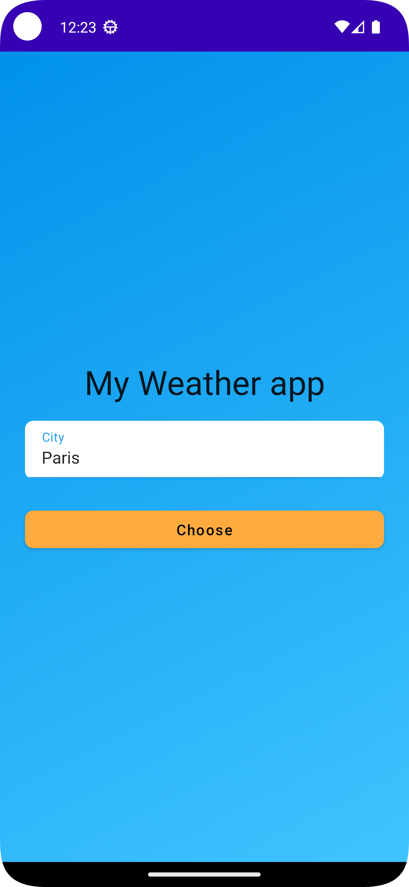

# WeatherApplication

A modern Android weather application built with Kotlin and Jetpack Compose that provides real-time weather information for cities worldwide. The app features a clean, intuitive interface and utilizes the OpenWeatherMap API to deliver accurate weather data including temperature, humidity, pressure, and current conditions.

## Table of Contents

- [Features](#features)
- [Screenshots](#screenshots)
- [Tech Stack](#tech-stack)
- [Architecture](#architecture)
- [Prerequisites](#prerequisites)
- [Installation & Setup](#installation--setup)
- [Configuration](#configuration)
- [Project Structure](#project-structure)
- [Building the Project](#building-the-project)
- [Dependencies](#dependencies)
- [API Reference](#api-reference)
- [Contributing](#contributing)
- [Author](#author)
- [License](#license)

## Features

- **City Search**: Enter any city name to get current weather information
- **Real-time Weather Data**: Fetch live weather data including:
  - Current temperature (Celsius)
  - Atmospheric pressure
  - Humidity percentage
  - Weather conditions and descriptions
  - Wind speed and direction
  - Cloud coverage
- **Clean UI**: Modern Material Design interface built with Jetpack Compose
- **Responsive**: Smooth transitions and loading states
- **Offline Handling**: Graceful error handling for network issues
- **Pull to Refresh**: Update weather data with a simple refresh action

## Screenshots

<div align="center">
  
  
</div>

## Tech Stack

### Core Technologies
- **Language**: Kotlin
- **UI Framework**: Jetpack Compose (1.2.1)
- **Minimum SDK**: 21 (Android 5.0 Lollipop)
- **Target SDK**: 33 (Android 13)
- **Build System**: Gradle

### Android Jetpack Components
- **Compose UI**: Modern declarative UI toolkit
- **ViewModel**: Lifecycle-aware UI data management
- **Navigation Compose**: Type-safe navigation between screens
- **Lifecycle**: Lifecycle-aware components
- **Kotlin Coroutines**: Asynchronous programming

### Dependency Injection
- **Dagger Hilt**: Compile-time dependency injection framework

### Networking
- **Retrofit 2.9.0**: Type-safe HTTP client
- **OkHttp 5.0.0**: HTTP client for network operations
- **Gson Converter**: JSON serialization/deserialization

### Other Libraries
- **Material Icons Extended**: Extended material design icons
- **Room**: Local database (included for future caching features)
- **Kotlin Coroutines**: Asynchronous programming with Flow and LiveData

## Architecture

This application follows the **MVVM (Model-View-ViewModel)** architecture pattern with Clean Architecture principles:

```
┌─────────────────────────────────────────────┐
│                UI Layer                      │
│  (Composables, Screens, Navigation)         │
└──────────────────┬──────────────────────────┘
                   │
┌──────────────────▼──────────────────────────┐
│            ViewModel Layer                   │
│  (WeatherViewModel, State Management)       │
└──────────────────┬──────────────────────────┘
                   │
┌──────────────────▼──────────────────────────┐
│             Data Layer                       │
│  (Repository, API, Models)                  │
└─────────────────────────────────────────────┘
```

### Key Components

- **UI Layer**: Jetpack Compose screens (ChooseCityScreen, WeatherScreen)
- **ViewModel**: Manages UI state and business logic
- **Data Layer**: Retrofit API interface, data models, and repository pattern
- **DI Layer**: Hilt modules for dependency injection

## Prerequisites

Before you begin, ensure you have the following installed:

- **Android Studio**: Arctic Fox (2020.3.1) or higher
- **JDK**: Java Development Kit 8 or higher
- **Android SDK**: API Level 33
- **Gradle**: 7.0.4 or higher (included in wrapper)
- **OpenWeatherMap API Key**: [Get your free API key here](https://openweathermap.org/api)

## Installation & Setup

### 1. Clone the Repository

```bash
git clone https://github.com/alassanepaulyaro/-WeatherApplication.git
cd -WeatherApplication
```

### 2. Get OpenWeatherMap API Key

1. Visit [OpenWeatherMap](https://openweathermap.org/api)
2. Sign up for a free account
3. Navigate to API Keys section
4. Generate a new API key
5. Copy your API key for the next step

### 3. Configure API Key

Create a `local.properties` file in the project root directory (if it doesn't exist):

```properties
# local.properties
sdk.dir=/path/to/your/Android/sdk
API_KEY="your_openweathermap_api_key_here"
```

**Important**: The `local.properties` file is ignored by git to keep your API key secure. Never commit this file to version control.

### 4. Sync Project

Open the project in Android Studio and sync Gradle:
- Click **File > Sync Project with Gradle Files**
- Wait for dependencies to download

### 5. Run the Application

- Connect an Android device or start an emulator
- Click the **Run** button (▶️) in Android Studio
- Select your target device
- Wait for the app to build and install

## Configuration

### API Configuration

The app uses the OpenWeatherMap API. The API key is configured in `local.properties` and accessed via `BuildConfig`:

```kotlin
// app/build.gradle
buildConfigField "String", "API_KEY", "${properties.getProperty('API_KEY')}"
```

### Permissions

The app requires the following permissions (declared in `AndroidManifest.xml`):

```xml
<uses-permission android:name="android.permission.INTERNET"/>
```

### Customization

#### Change Temperature Units

In `WeatherApi.kt`, you can modify the units parameter:

```kotlin
@Query("units") units: String = "metric"  // metric, imperial, or standard
```

#### Modify Base URL

In `AppModule.kt` (DI module), update the Retrofit base URL if needed:

```kotlin
.baseUrl("https://api.openweathermap.org/data/2.5/")
```

## Project Structure

```
-WeatherApplication/
├── app/
│   ├── src/
│   │   ├── main/
│   │   │   ├── java/com/paulyaro/mywetherapp/
│   │   │   │   ├── data/              # Data layer
│   │   │   │   │   ├── WeatherApi.kt  # Retrofit API interface
│   │   │   │   │   ├── CityWeather.kt # Main weather model
│   │   │   │   │   ├── Weather.kt     # Weather details model
│   │   │   │   │   ├── Main.kt        # Temperature/pressure data
│   │   │   │   │   ├── Wind.kt        # Wind information
│   │   │   │   │   ├── Clouds.kt      # Cloud data
│   │   │   │   │   ├── Coord.kt       # Coordinates
│   │   │   │   │   └── Sys.kt         # System data
│   │   │   │   ├── di/                # Dependency injection
│   │   │   │   │   └── AppModule.kt   # Hilt DI module
│   │   │   │   ├── ui/                # UI layer
│   │   │   │   │   ├── chooseCity/
│   │   │   │   │   │   └── ChooseCityScreen.kt
│   │   │   │   │   ├── weatherCity/
│   │   │   │   │   │   ├── WeatherScreen.kt
│   │   │   │   │   │   └── WeatherViewModel.kt
│   │   │   │   │   ├── theme/         # Compose theme
│   │   │   │   │   │   ├── Color.kt
│   │   │   │   │   │   ├── Shape.kt
│   │   │   │   │   │   ├── Theme.kt
│   │   │   │   │   │   └── Type.kt
│   │   │   │   │   └── util/          # UI utilities
│   │   │   │   │       ├── Navigation.kt
│   │   │   │   │       └── Screen.kt
│   │   │   │   ├── utils/             # Utilities
│   │   │   │   │   └── Resource.kt    # Resource wrapper
│   │   │   │   ├── MainActivity.kt    # Entry point
│   │   │   │   └── MyWeatherApp.kt    # Application class
│   │   │   ├── res/                   # Resources
│   │   │   └── AndroidManifest.xml
│   │   ├── androidTest/               # Instrumented tests
│   │   └── test/                      # Unit tests
│   └── build.gradle                   # App-level build config
├── gradle/                            # Gradle wrapper
├── build.gradle                       # Project-level build config
├── settings.gradle                    # Project settings
├── gradle.properties                  # Gradle properties
├── local.properties                   # Local SDK path & API key
├── Screenshot_home_my_weather_app.png
├── Screenshot_Detail_my_weather_app.png
└── README.md
```

## Building the Project

### Debug Build

```bash
./gradlew assembleDebug
```

The APK will be generated at:
```
app/build/outputs/apk/debug/app-debug.apk
```

### Release Build

```bash
./gradlew assembleRelease
```

**Note**: For release builds, configure signing in `app/build.gradle`:

```gradle
android {
    signingConfigs {
        release {
            storeFile file("your-keystore.jks")
            storePassword "your-store-password"
            keyAlias "your-key-alias"
            keyPassword "your-key-password"
        }
    }
    buildTypes {
        release {
            signingConfig signingConfigs.release
            minifyEnabled true
            proguardFiles getDefaultProguardFile('proguard-android-optimize.txt'), 'proguard-rules.pro'
        }
    }
}
```

### Run Tests

```bash
# Unit tests
./gradlew test

# Instrumented tests
./gradlew connectedAndroidTest
```

## Dependencies

### Production Dependencies

| Library | Version | Purpose |
|---------|---------|---------|
| Kotlin | 1.7.0 | Programming language |
| Jetpack Compose | 1.2.1 | UI framework |
| Compose Compiler | 1.3.0 | Compose compiler |
| Dagger Hilt | 2.43.2 | Dependency injection |
| Retrofit | 2.9.0 | REST API client |
| OkHttp | 5.0.0-alpha.2 | HTTP client |
| Gson | 2.9.0 | JSON parser |
| Coroutines | 1.6.4 | Async programming |
| Navigation Compose | 2.6.0-alpha01 | Navigation |
| Lifecycle ViewModel | 2.6.0-alpha02 | ViewModel |
| Room | 2.4.3 | Local database |

### Testing Dependencies

| Library | Purpose |
|---------|---------|
| JUnit 4.13.2 | Unit testing |
| Espresso 3.4.0 | UI testing |
| Compose UI Test | Compose testing |
| Hilt Testing | DI testing |

## API Reference

### OpenWeatherMap API

**Base URL**: `https://api.openweathermap.org/data/2.5/`

**Endpoint**: `GET /weather`

**Query Parameters**:
- `q` (required): City name (e.g., "London", "Paris")
- `appid` (required): Your API key
- `units` (optional): Units of measurement (metric, imperial, standard)

**Example Response**:
```json
{
  "coord": { "lon": -0.1257, "lat": 51.5085 },
  "weather": [
    {
      "id": 800,
      "main": "Clear",
      "description": "clear sky",
      "icon": "01d"
    }
  ],
  "main": {
    "temp": 15.5,
    "feels_like": 14.8,
    "pressure": 1013,
    "humidity": 72
  },
  "wind": {
    "speed": 3.6,
    "deg": 230
  }
}
```

**Rate Limits**:
- Free tier: 60 calls/minute, 1,000,000 calls/month
- For higher limits, check [OpenWeatherMap pricing](https://openweathermap.org/price)

## Contributing

Contributions are welcome! Please follow these steps:

1. **Fork the repository**
2. **Create a feature branch**
   ```bash
   git checkout -b feature/amazing-feature
   ```
3. **Commit your changes**
   ```bash
   git commit -m "Add some amazing feature"
   ```
4. **Push to the branch**
   ```bash
   git push origin feature/amazing-feature
   ```
5. **Open a Pull Request**

### Code Style

- Follow [Kotlin coding conventions](https://kotlinlang.org/docs/coding-conventions.html)
- Use meaningful variable and function names
- Add comments for complex logic
- Write unit tests for new features

## Author

**Alassane Paulyaro**
- GitHub: [@alassanepaulyaro](https://github.com/alassanepaulyaro)

If you have any questions, issues, or suggestions, feel free to [open an issue](https://github.com/alassanepaulyaro/-WeatherApplication/issues).

## License

This project is available under the MIT License. See the LICENSE file for more details.

---

## Troubleshooting

### Common Issues

#### API Key Not Working
- Ensure your API key is correctly added to `local.properties`
- Verify the key is active on OpenWeatherMap dashboard
- Wait a few hours after creating a new API key (activation time)

#### Build Errors
```bash
# Clean and rebuild
./gradlew clean
./gradlew build
```

#### Gradle Sync Issues
- Check your internet connection
- Invalidate caches: **File > Invalidate Caches / Restart**
- Update Gradle wrapper: `./gradlew wrapper --gradle-version=7.5`

#### App Crashes on Launch
- Check Logcat for error messages
- Verify all required permissions are granted
- Ensure minimum SDK requirements are met

## Future Enhancements

- [ ] Add location-based weather detection (GPS)
- [ ] Implement 5-day weather forecast
- [ ] Add weather notifications
- [ ] Support for multiple cities (favorites)
- [ ] Offline caching with Room database
- [ ] Weather widgets
- [ ] Dark mode support
- [ ] Animated weather backgrounds
- [ ] Unit conversion (Celsius/Fahrenheit)
- [ ] Hourly weather breakdown

---

**⭐ If you find this project useful, please consider giving it a star!**
